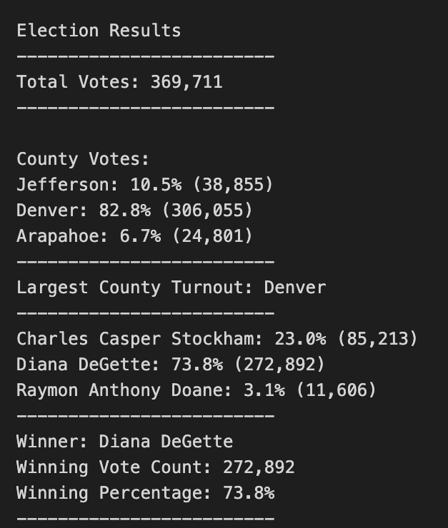

# election-analysis
# Overview of Election Audit
This project uses Colorado Board of Election data from a recent election to complete an audit to confirm the following:
1. Determine the total number of votes.
2. Identify all of the candidates included in the election.
3. Sum the total # of votes each candidate received.
4. Calculate what percentage of the total vote each candidate received.
5. Determine the winner of the election.

# Resources
- Data Source: election_results.csv
- Software: Python 3.7.6 & VS Code 1.62.3

# Election Audit Results

The results of the election analysis were as follows:
- There were a total of 369,711 votes cast in the election
- Votes were gathered from the following counties including their voting turnout:
    - Jefferson: 38,855 votes accounting for 10.5% of the total vote
    - Denver: 306,055 votes accounting for 82.8% of the total vote
    - Arapahoe: 24,801 votes accounting for 6.7% of the total vote
- Denver County collected the most votes totaling 306,055
- The individual candidate results were as follows:
    - Charles Casper Stockham received 85,213 votes representing 23.0% of the total votes.
    - Diana DeGette received 272,892 votes representing 73.8% of the total votes.
    - Raymon Anthony Doane received 11,606 votes representing 3.1% of the total votes.
- Diana DeGette won the election with 272,892 votes and 73.8% of the total votes.

# Election Audit Summary
The script created in this project has streamlined the audit process and is flexible enough to use in future audits. In order for this script to be used in future situations, a user must be aware of 2 things:
1. They must ensure that the read and write files are referencing the correct locations of the source file/output files.
2. They must also ensure that the column references within the script align to the correct columns within the source data.  That means updating the "row" and "header" references depending on what is included in the source file.
